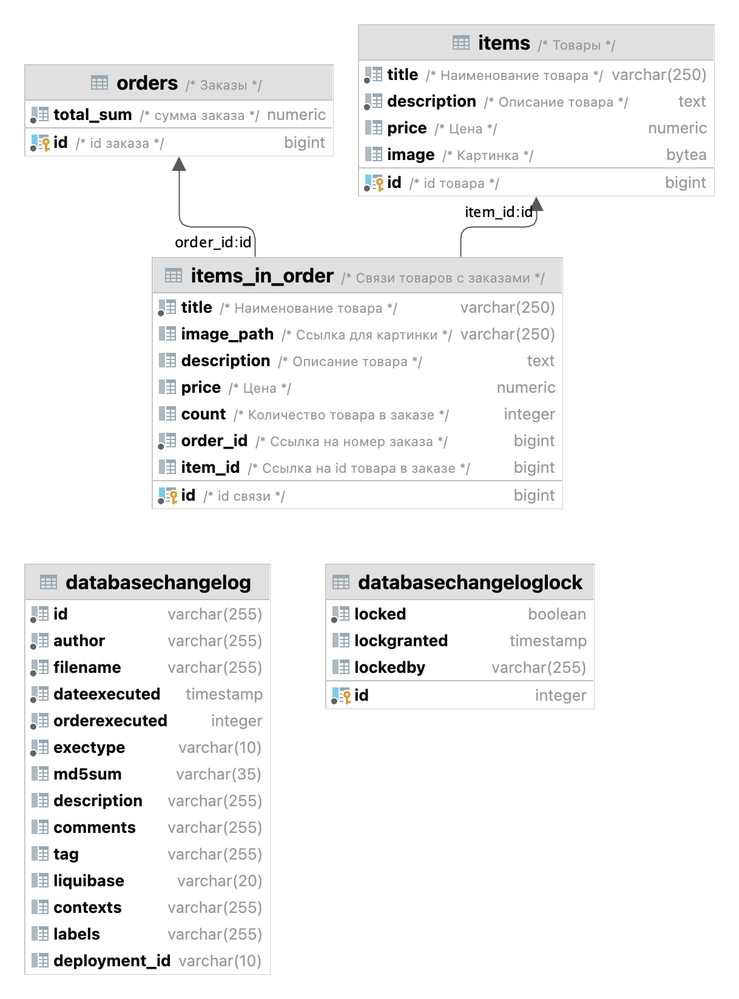

# myblog

Веб-приложение представляет собой витрину товаров, которые пользователь может положить в корзину и купить.

Приложение состоит из семи основных частей (модулей): 
* страница витрины товаров, доступных для просмотра и покупки; 
* страница товара; 
* страница корзины покупателя; 
* страница всех заказов; 
* страница заказа; 
* сервис покупки;
* страница загрузки товара в витрину.

## Страница витрины товаров 
* список товаров, доступных для заказа, с пагинацией, возможностью поиска с фильтрацией по названию и сортировкой по цене, алфавиту.

## Страница карточки товара
* название, 
* картинка, 
* описание товара,
* цена товара. 
Переход на страницу происходит при нажатии на товар. Существует возможность положить товар в корзину/удалить его,
и изменить количество товара в корзине.

## Корзина
* список положенных в корзину товаров, 
* их количество, 
* цена каждого товара и
* общая цена всей корзины. 
Переход в корзину возможен с любой веб-страницы с товарами. Есть возможность удалить товар из корзины, изменить его количество;
есть кнопка оформления заказа. При нажатии на кнопку оформления заказа происходит эмуляция оформления заказа.

## Страница заказов
* список всех оформленных заказов, 
* сумма каждого заказа. 
Переход на страницу заказов возможен с любой веб-страницы с товарами.

## Страница заказа
* список купленных товаров,
* сумма за каждый товар,
* общая сумма заказа. 
Переход на страницу заказа осуществляется при нажатии на заказ на странице заказов.

## Страница оформленного заказа
Переход на страницу оформленного заказа происходит при эмуляции оформления заказа.

## Страница добавления товара
На странице добавления товара необходимо заполнить поля с информацией о товаре:
* название,
* картинка,
* описание товара,
* цена товара. 

## _Структура проекта_
> Spring Framework 
> Java: 21 
> СУБД PostgreSQL: 17.5 

### ER diagram

## _Запуск приложения_
Приложение можно запустить локально: 
* локально 
_java -jar build/libs/online-shop-0.0.1-SNAPSHOT.jar_
* в Docker-контейнере 
_docker-compose up -d --build_